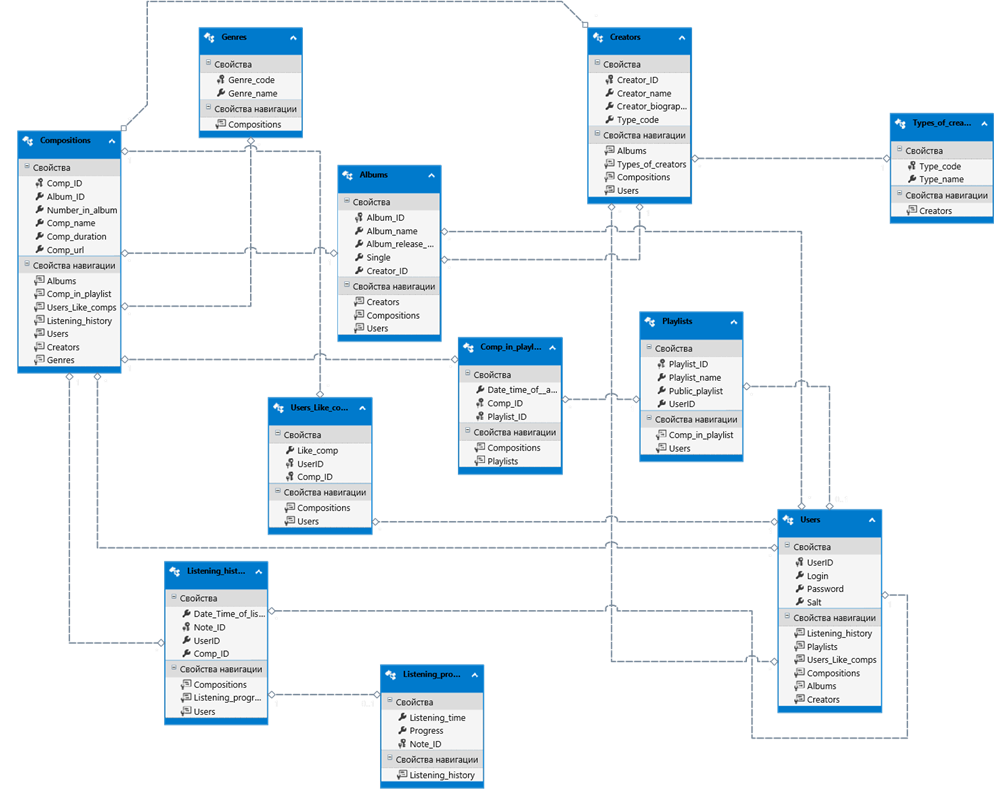
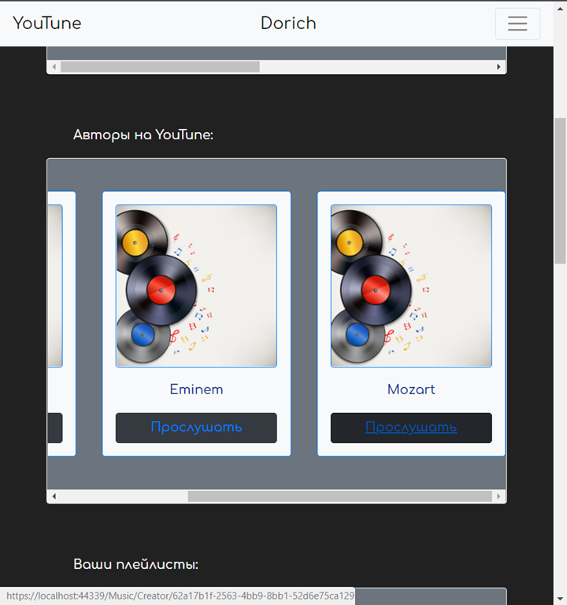
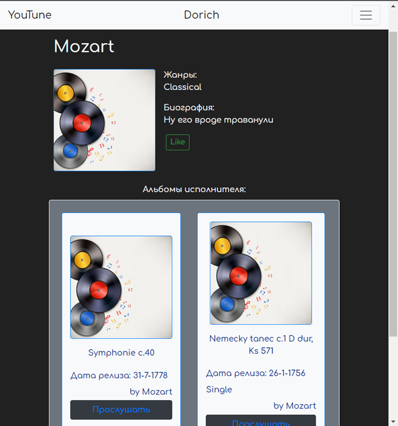
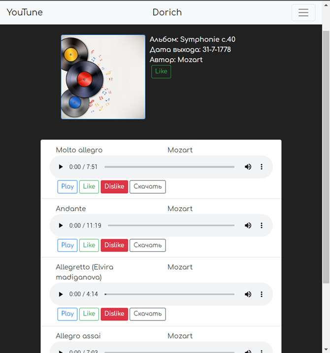
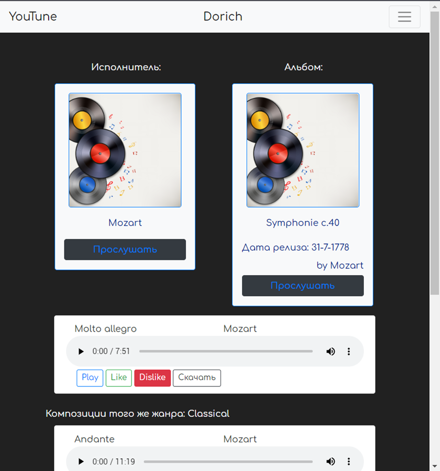

During learning in the university I've completed a course project of music web platform. It was supposed to use ASP.NET MVC pattern, Entity Framework, Bootstrap.

<!--more-->

Unfortunately, source code and database were deleted. Now there are only reports about project.

## Purpose of the work

Get the basic skills to perform a full cycle of designing and creating a database. Implement ASP.NET web application using MVC pattern, Entity Framework, Bootstrap.

7. *Music portal*  
   Some Internet site provides a service for listening to and downloading music.  
   It is necessary to store information about performers (groups, ensembles, orchestras, solo performers ...), albums (both albums of groups and collections), compositions (including singles).  
   Registered users of the site can listen to compositions, download, mark "favorite" performers, put "likes" on compositions. The history of listening and downloading is stored in the database (for example, for subsequent analysis of preferences and statistics).

## Database

It was needed to create a database using database-first approach, so I get experience of work with:
- SQL
- MS SQL Server databases
- SQL Server Data Tools (IDE for MS SQL Server)

Here you can see diagram of generated classes due to created database:

## Navigation

In the application, navigation is implemented in the following way: it takes only a few clicks to access almost every page.

Each composition object has a link to its personal page and its artist.

From the personal page of the composition, you can go to one of the songs of the same genre, the album of the composition, the artist of the composition.

From the artist's personal page, you can also see all his albums.

However, a single path can still be identified. For example: main page - artist - album - composition. At each stage of this path, you have access to any other.

