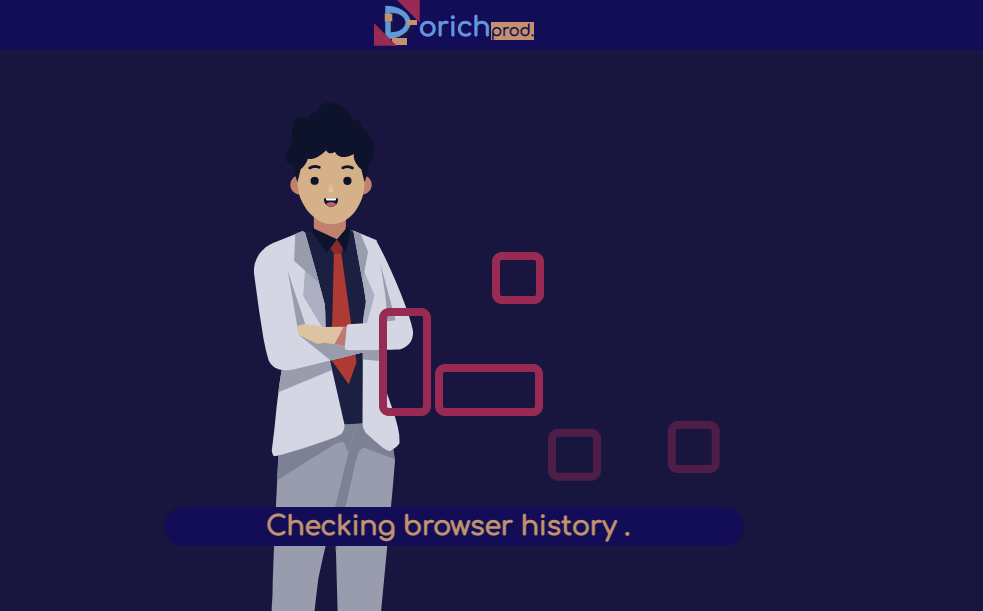

## Latest version (v3)

The very latest iteration of my own website. I made decision to make some things simpler. But functionality became better.

I had several problems with second iteration:
1. Maintaining server and database is quite expensive for small website.
2. At the moment for its development GitHub pages did not support HTML5 history mode for router. So SEO was completely impossible.
3. SPA are not optimized for Search Engines.
4. Open Graph protocol does not work with SPA.
5. Creating editor features only for me takes too long.

To solve all these problems, I migrated to Gridsome SSG. As it is built over Vue.js, I was able to move all existing styles and components to new project without problems. And the results as follows:
1. Databases are not needed now as all the content is inside client repository in form of `.md` files.
2. Gridsome creates HTML page for each webpage, so it is possible to have common routing without `#`.
3. SEO works ideally with prerendered HTML.
4. There are no problems for Open Graph to parse content of prerendered HTML.
5. Now it is possible to edit content as markdown, and I don't need to implement my own features.

Website still works as SPA and it has all features of SPA. It seems it is the very last major update of this website.

## Version 2 (2021)

I needed a resource that would demonstrate my web development competence in
itself and simply by describing what I can.

Here information is provided directly about me, here projects
that I want to share with others are collected, here resumes have
been worked out for possible responses to vacancies. It is also planned
to create a blog with related functionality.

You cannot try most of the functionality, since it is related to
data editing and is available only to me. However, be sure everything
is beautifully done.

This was the project in which I put the most of my heart. 
When writing new functionality, I try to use some new technology for myself,
so as not to stand still. And of course I tried to make it comfortable,
I hope you felt it.

Used technologies: Dropbox, Vue.js, Fastify, Node.js, Firebase, PostgreSQL, Vuetify.

```plantuml
left to right direction

node Client [
Client
----
Vue.js
Vuetify
]
node Server [
Server
----
Node.js
Fastify
]
cloud FileStore [
File Store
----
Dropbox <&box>
]

database AuthDb [
Authentification DB
----
PostgreSQL
]

database ProjectsDb [
Projects DB
----
PostgreSQL
]

database ResumeDb [
Resume DB
----
Firebase
]

Client -d- Server
Client -- FileStore
Server -l- FileStore
Server -d- AuthDb
Server -d- ProjectsDb
Server -d- ResumeDb

```

## Version 1 (2020)

My first acquaintance with web technologies.

At that moment, I was immersed in creating video and believed that I needed a site with a presentation of myself as a specialist in development and video creation at the same time. A site where the user could see examples of my work, see the prices for my services, get acquainted with my work pipeline and send a request for cooperation. Support for different languages was also planned.

The idea was good and interesting, but I stumbled upon a lack of experience with the technologies used. At first I created static pages, then I transferred everything to a single page application. Maintainability only suffered from this.

Previously, this site occupied this address, and it can be considered the very first version. I manually placed the images for it in the project repository, and now they are no longer here of course, so I see no reason to launch this project for viewing at a different address, but you can familiarize yourself with the client's source code to compare my skills then and today.

Used technologies: Vue.js, Express, Node.js, Firebase, MongoDB, Mongoose

